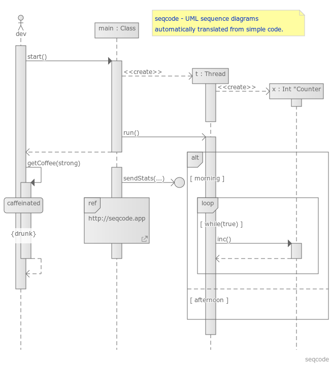

# README

Provides sequence diagram generation from seqcode text files - a simple programming language like script that translates into UML Sequence diagrams.

For more information see:
- https://seqcode.app
- https://github.com/belteshazzar/seqcode

## Features

Generates sequence diagram for currently selected seqcode file. Supports navigation between diagrams that exist in the workspace.

## Requirements

This extension depends on seqcode language support.

## Extension Settings

There are no settings.

## Known Issues

No known issues.
